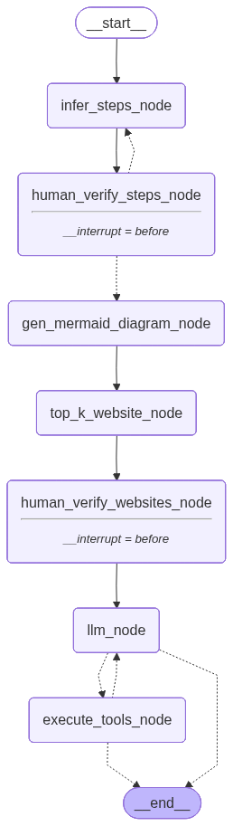

# Marketing Campaign Architect Agent 🚀

An advanced, autonomous AI agent powered by **LangGraph** designed to act as a Chief Marketing Officer. You provide a prompt, and the agent researches the web, analyzes competitors, extracts current marketing trends, and formulates a complete end-to-end marketing campaign.

## 🧠 Architecture: The Hybrid ReAct Graph
The agent is built on a custom **Hybrid StateGraph** architecture. It combines a linear, procedural setup sequence with a dynamic, tool-calling ReAct (Reasoning + Acting) loop.



### The Two Phases:
1. **The Linear Setup**:
   - **`infer_steps_node`**: Analyzes your initial prompt and breaks the campaign down into parallel and sequential execution steps.
   - **`gen_mermaid_diagram_node`**: Generates a visual Mermaid diagram of the inferred campaign timeline.
   - **`top_k_website_node`**: Scrapes the web for your top competitor websites based on your product category.
2. **The ReAct Brain Loop**:
   - **`llm_node`**: The core decision engine. It looks at the current state of its memory and decides what tools to call next.
   - **`execute_tools_node`**: The "hands" of the agent. It executes web searches for current trends, queries historical campaign databases, and parses the messy raw text into structured JSON data using secondary LLM calls. It loops back and forth with the Brain until the final `generation_tool` is called.

## 🛑 Human-in-the-Loop Interventions
AI agents shouldn't run entirely unsupervised. This workflow implements strategic manual breakpoints:
- **Campaign Step Verification**: Before the agent does any web research, it prints its inferred step-by-step plan. If you reject it, you can instantly inject a new prompt to rewind and regenerate the strategy.
- **Website Curation**: After finding competitors, the agent pauses to present you with the URLs. You can select the specific websites you want the LLM Brain to analyze, filtering out irrelevant noise.

## 🛠️ Tech Stack
- **LangGraph**: For complex, stateful graph orchestration and memory routing.
- **Pydantic**: For strict, production-grade JSON schema enforcement.
- **Tavily / BeautifulSoup**: For dynamic web scraping and search integrations.
- **Asyncio**: For non-blocking terminal interaction and concurrent API execution.

## 🚀 How to Run
Make sure you have your environment variables set (e.g., `OPENAI_API_KEY`, `TAVILY_API_KEY`).

```bash
# Run the workflow
uv run src/main.py
```
